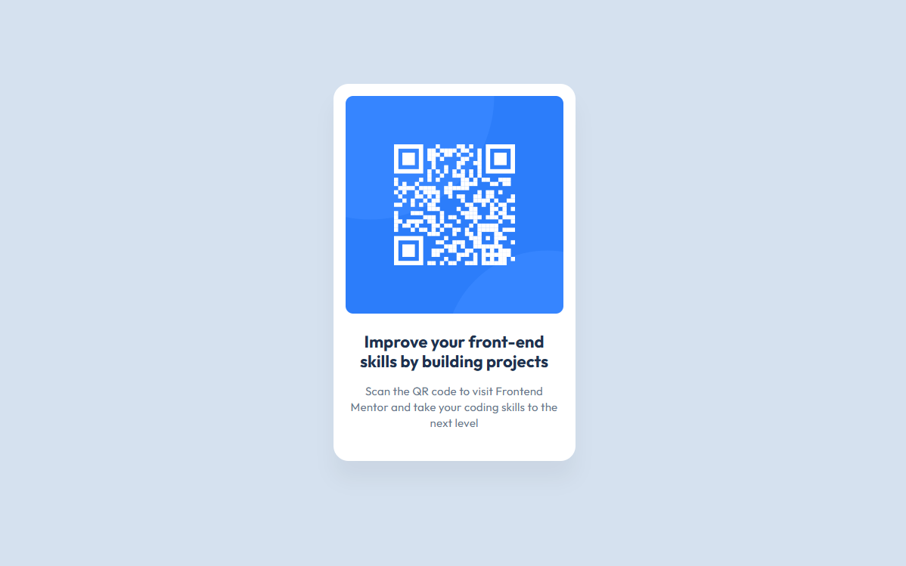

# Frontend Mentor - QR code component solution

This is a solution to the [QR code component challenge on Frontend Mentor](https://www.frontendmentor.io/challenges/qr-code-component-iux_sIO_H). Frontend Mentor challenges help you improve your coding skills by building realistic projects. 

## Table of contents

- [Overview](#overview)
  - [Screenshot](#screenshot)
  - [Links](#links)
- [My process](#my-process)
  - [Built with](#built-with)
  - [What I learned](#what-i-learned)
- [Author](#author)

## Overview

### Screenshot

### Links

- Solution URL: [Add solution URL here](https://your-solution-url.com)
- Live Site URL: [Add live site URL here](https://your-live-site-url.com)

## My process

### Built with

- HTML & CSS custom properties
- Flexbox

### What I learned

I focused on responsive design by using 'flex' properties, allowing the component to react to different screen sizes. 

The only thing I had to look up for this project was how to control the box shadow effects - which [MDN Web Docs](https://developer.mozilla.org/en-US/docs/Web/CSS/box-shadow) was a helpful resource. 

## Author

- Website - [Colleen](https://www.colleennicole.com)
- Frontend Mentor - [@colleennicole223](https://www.frontendmentor.io/profile/colleennicole223)

**Note: Delete this note and add/remove/edit lines above based on what links you'd like to share.**
